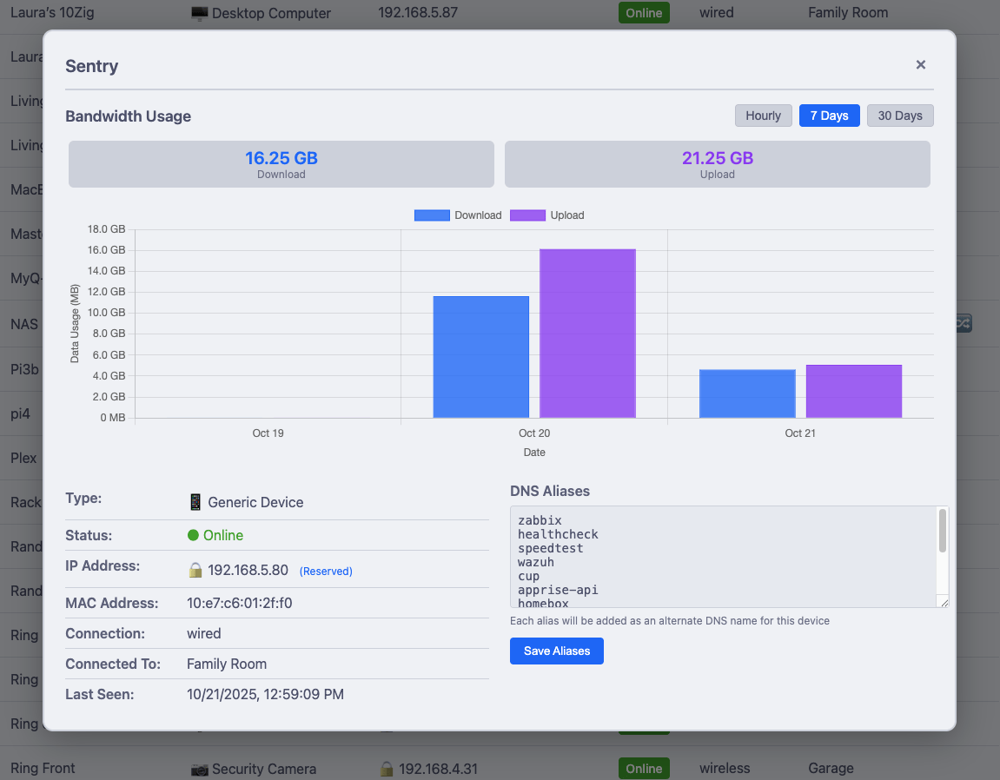
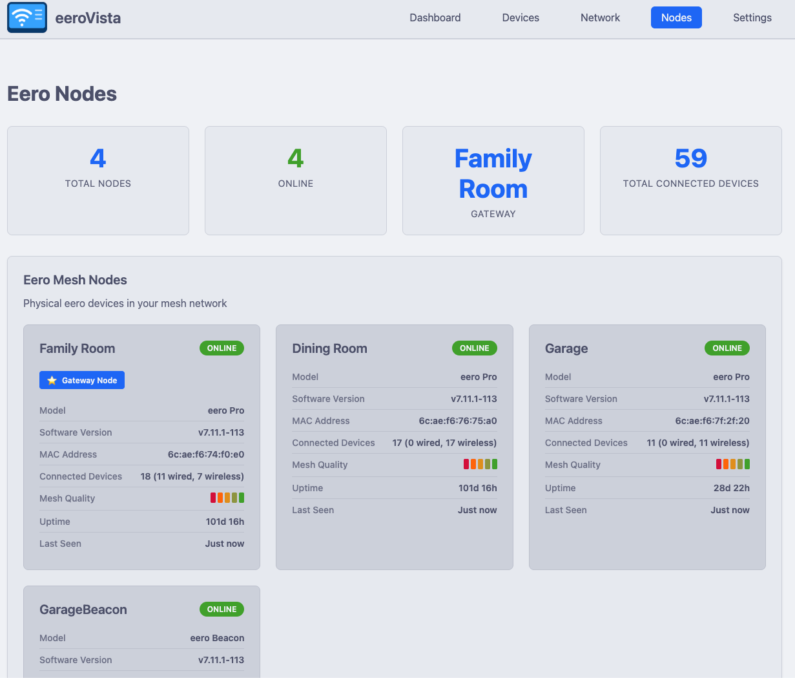
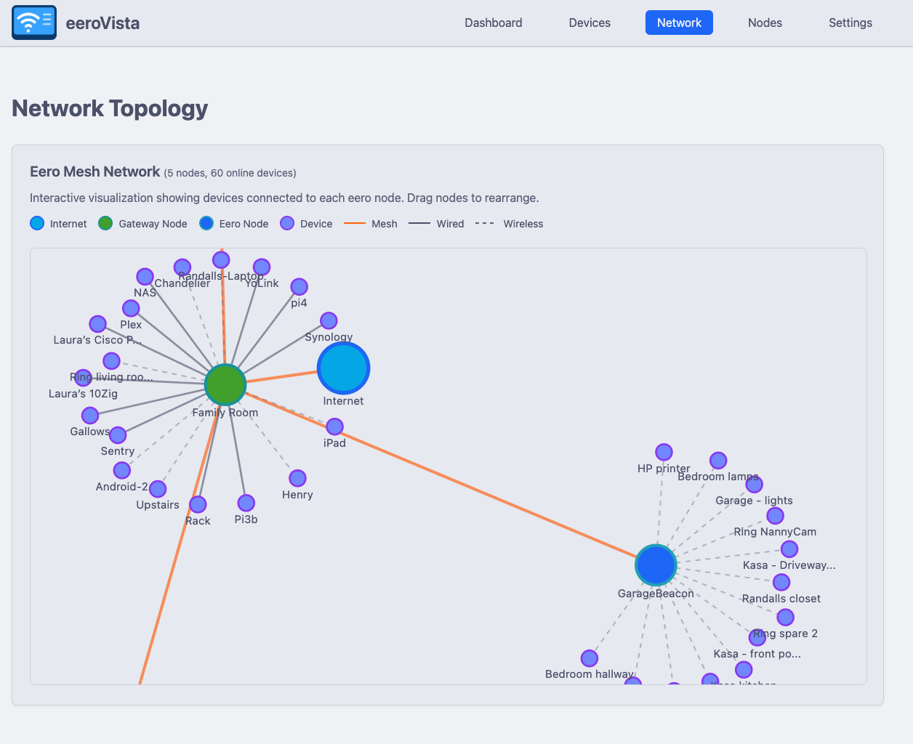

# eeroVista

<div align="center">
  

  <p><strong>Read-only monitoring for Eero mesh networks</strong></p>

  [](https://opensource.org/licenses/MIT)
  [](https://www.python.org/downloads/)
  [](https://github.com/Yeraze/eeroVista/pkgs/container/eeroVista)
[](https://github.com/Yeraze/eeroVista/pkgs/container/eeroVista)
</div>

---

## Overview

eeroVista is a **read-only** web-based monitoring tool for Eero mesh networks. It provides:

- 📊 **Real-time Dashboard** - View network status, connected devices, and bandwidth usage
- 📈 **Historical Data** - Track device connections and network performance over time
- 🚀 **Speedtest History** - Monitor ISP performance with historical speedtest results
- 🔌 **Multi-Format Exports** - Prometheus metrics, Zabbix LLD, and JSON API
- 🎨 **Beautiful UI** - Clean interface using the Catppuccin Latte color theme
- 🐳 **Docker-Ready** - Simple container deployment with persistent storage

## Features

### Web Interface
- Network overview dashboard with real-time statistics
- Device list with connection status, signal strength, and bandwidth
- Network topology visualization showing mesh node connections
- Speedtest history graphs and trends
- Clean, accessible UI with Catppuccin Latte theme

### Monitoring Integration
- **Prometheus** metrics endpoint for scraping
- **Zabbix** Low-Level Discovery (LLD) for devices and nodes
- **JSON API** for custom integrations
- Health check endpoint for uptime monitoring

### Data Collection
- Automatic background collection of device metrics (every 30s)
- Network-wide statistics (every 60s)
- Passive speedtest result collection
- Configurable data retention policies

## Quick Start

### Using Docker Compose (Recommended)

1. Clone the repository:
   ```bash
   git clone https://github.com/Yeraze/eeroVista.git
   cd eeroVista
   ```

2. Create data directory:
   ```bash
   mkdir data
   ```

3. Start the container:
   ```bash
   docker compose up -d
   ```

4. Open your browser to `http://localhost:8080`

5. Complete the first-run setup wizard to authenticate with your Eero account

### Using Docker Run

```bash
docker run -d \
  --name eerovista \
  -p 8080:8080 \
  -v $(pwd)/data:/data \
  --restart unless-stopped \
  yeraze/eerovista:latest
```

## Documentation

Full documentation is available at [https://yeraze.github.io/eeroVista/](https://yeraze.github.io/eeroVista/)

- [Getting Started Guide](docs/getting-started.md)
- [Configuration Reference](docs/configuration.md)
- [API Documentation](docs/api-reference.md)
- [Prometheus Integration](docs/prometheus.md)
- [Zabbix Integration](docs/zabbix.md)
- [Development Guide](docs/development.md)
- [Architecture Documentation](ARCHITECTURE.md)

## Screenshots

### Dashboard

*Real-time network overview with bandwidth usage, top consumers, and network statistics*

### Device List

*Connected devices with status, IP addresses, signal strength, and port forwarding indicators*

### Device Details

*Individual device metrics, bandwidth graphs, DNS aliases, and port forward configuration*

### Network Topology

*Mesh network topology showing nodes, connection quality, and routing configuration*

### Topology Visualization

*Visual representation of network mesh connections and device distribution*

## Important Notes

⚠️ **Read-Only System**: eeroVista cannot modify your Eero configuration, reboot devices, or trigger speedtests. It only reads existing data from your network.

⚠️ **Unofficial**: This project uses reverse-engineered APIs and is not affiliated with or endorsed by Eero.

⚠️ **Local Storage**: All data is stored locally in SQLite. No data is sent to external services.

⚠️ **Amazon Login Limitation**: If your Eero account uses Amazon for login, eeroVista may not work directly due to API limitations. **Workaround**: Have someone in your household create a standard Eero account (with email/password) and invite them as an admin to your network. Then use those credentials to authenticate eeroVista.

## Troubleshooting & FAQ

### I see all my devices but no bandwidth data
This is normal behavior. eeroVista does not have access to historical data from before it was started. Only bandwidth and connection data collected **after the container launches** will be tracked. You should start seeing bandwidth graphs after data has been collected for a few minutes.

### Authentication fails with "Account linked with Amazon" error
Your Eero account is linked to Amazon Login, which is not directly supported by the API. See the workaround in the Important Notes section above - create a separate admin account using email/password authentication.

### Data appears to be missing after restart
If you restart the container without persisting the `/data` directory, all collected data will be lost. Make sure you're using a volume mount (as shown in the Quick Start) to persist your database.

## Configuration

Configure eeroVista via environment variables in `docker-compose.yml`:

```yaml
environment:
  # Collection intervals (seconds)
  - COLLECTION_INTERVAL_DEVICES=30      # Device metrics
  - COLLECTION_INTERVAL_NETWORK=60      # Network metrics

  # Data retention (days)
  - DATA_RETENTION_RAW_DAYS=7           # Raw time-series data
  - DATA_RETENTION_HOURLY_DAYS=30       # Hourly aggregates
  - DATA_RETENTION_DAILY_DAYS=365       # Daily aggregates

  # Logging
  - LOG_LEVEL=INFO                      # DEBUG, INFO, WARNING, ERROR
```

See [Configuration Reference](docs/configuration.md) for all options.

## API Endpoints

### Web Interface
- `/` - Dashboard
- `/devices` - Device list
- `/network` - Network topology
- `/speedtest` - Speedtest history

### Monitoring Integration
- `/metrics` - Prometheus metrics
- `/api/health` - Health check
- `/api/devices` - JSON device list
- `/api/zabbix/discovery/devices` - Zabbix device discovery
- `/api/zabbix/discovery/nodes` - Zabbix node discovery

See [API Reference](docs/api-reference.md) for complete documentation.

## Technology Stack

- **Backend**: FastAPI, SQLAlchemy, APScheduler
- **Frontend**: Jinja2, Chart.js, Bootstrap (Catppuccin Latte theme)
- **Database**: SQLite
- **API Client**: eero-client Python package
- **Containerization**: Docker

## Development

### Local Setup

```bash
# Clone repository
git clone https://github.com/Yeraze/eeroVista.git
cd eeroVista

# Create virtual environment
python3 -m venv venv
source venv/bin/activate

# Install dependencies
pip install -r requirements.txt

# Run development server
uvicorn src.main:app --reload --host 0.0.0.0 --port 8080
```

See [Development Guide](docs/development.md) for detailed setup instructions.

### Running Tests

```bash
pytest
pytest --cov=src --cov-report=html
```

## Contributing

Contributions are welcome! Please see the [Development Guide](docs/development.md) for:
- Setting up your development environment
- Code style guidelines (Black, Ruff)
- Testing requirements
- Pull request process

### Workflow

1. Fork the repository
2. Create a feature branch: `git checkout -b feature/my-feature`
3. Make your changes and add tests
4. Run tests and linters: `pytest && black src/ && ruff check src/`
5. Commit your changes: `git commit -m "feat: Add my feature"`
6. Push to your fork: `git push origin feature/my-feature`
7. Open a Pull Request

## Roadmap

- [ ] Initial release (v1.0.0)
  - [x] Core architecture and documentation
  - [ ] Database models and collectors
  - [ ] Web interface with Catppuccin theme
  - [ ] Prometheus exporter
  - [ ] Zabbix integration
  - [ ] Docker image

- [ ] Future enhancements
  - [ ] CSV export functionality
  - [ ] Webhook notifications
  - [ ] Advanced device filtering
  - [ ] Bandwidth heatmaps
  - [ ] Mobile-responsive design
  - [ ] Multi-network support

## License

MIT License - See [LICENSE](LICENSE) file for details

## Acknowledgments

- [eero-client](https://github.com/343max/eero-client) - Python library for Eero API
- [Catppuccin](https://github.com/catppuccin/catppuccin) - Soothing pastel theme
- [FastAPI](https://fastapi.tiangolo.com/) - Modern Python web framework
- [Chart.js](https://www.chartjs.org/) - JavaScript charting library

## Support

- **Documentation**: [https://yeraze.github.io/eeroVista/](https://yeraze.github.io/eeroVista/)
- **Issues**: [GitHub Issues](https://github.com/Yeraze/eeroVista/issues)
- **Discussions**: [GitHub Discussions](https://github.com/Yeraze/eeroVista/discussions)

## Star History

[](https://www.star-history.com/#yeraze/eeroVista&type=date&legend=top-left)
---

<div align="center">
  Made with ❤️ using the Catppuccin Latte theme
</div>
