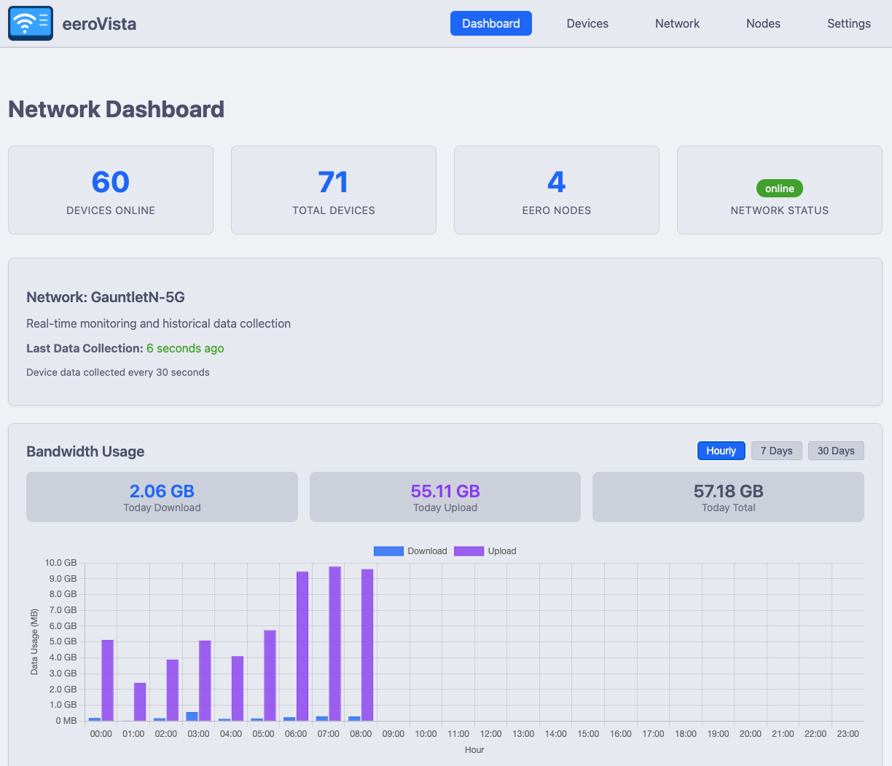
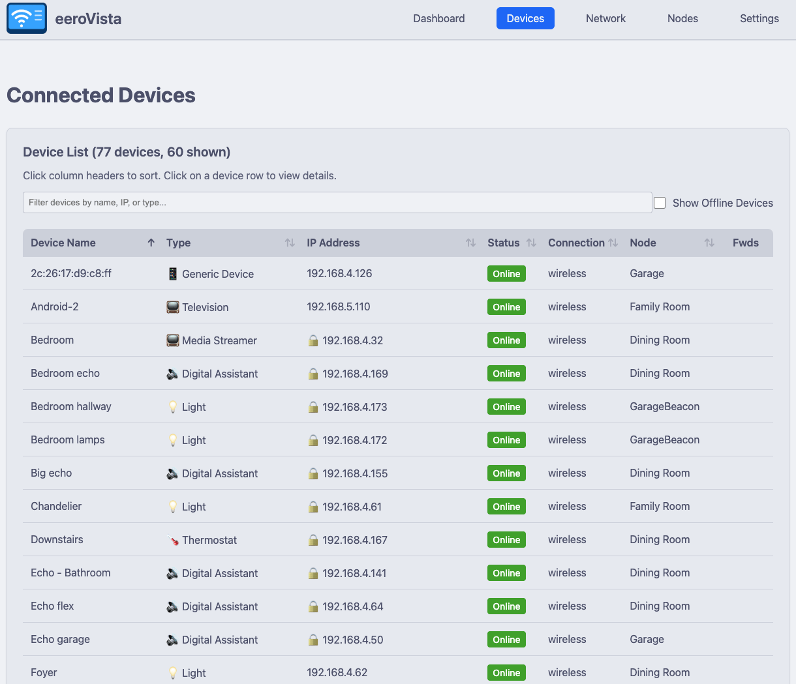

# Getting Started with eeroVista

This guide will help you set up and run eeroVista for the first time.

## Prerequisites

- Docker and Docker Compose installed
- An Eero mesh network with mobile app access
- Access to receive SMS verification codes

## Installation

### Method 1: Docker Compose (Recommended)

1. **Clone the repository**:
   ```bash
   git clone https://github.com/yeraze/eerovista.git
   cd eerovista
   ```

2. **Create data directory**:
   ```bash
   mkdir data
   ```

3. **Start the container**:
   ```bash
   docker compose up -d
   ```

4. **View logs**:
   ```bash
   docker compose logs -f eerovista
   ```

### Method 2: Docker Run

```bash
docker run -d \
  --name eerovista \
  -p 8080:8080 \
  -v $(pwd)/data:/data \
  --restart unless-stopped \
  eerovista:latest
```

## Initial Setup

### First Run Wizard

1. Open your browser to `http://localhost:8080` (or your server's IP)

2. You'll be prompted to authenticate with Eero:
   - Enter the phone number associated with your Eero account
   - Click "Send Verification Code"
   - Enter the 6-digit code received via SMS
   - Click "Verify"

3. Once authenticated, eeroVista will:
   - Discover your Eero network(s)
   - Identify all mesh nodes
   - Begin collecting device metrics
   - Start populating the database

4. Allow 2-3 minutes for initial data collection before viewing the dashboard

## Configuration

### Environment Variables

Edit `docker-compose.yml` to customize collection intervals and retention:

```yaml
environment:
  # Collection intervals (seconds)
  - COLLECTION_INTERVAL_DEVICES=30      # How often to collect device metrics
  - COLLECTION_INTERVAL_NETWORK=60      # How often to collect network metrics

  # Data retention (days)
  - DATA_RETENTION_RAW_DAYS=7           # Keep raw data for 7 days
  - DATA_RETENTION_HOURLY_DAYS=30       # Keep hourly aggregates for 30 days
  - DATA_RETENTION_DAILY_DAYS=365       # Keep daily aggregates for 1 year

  # Logging
  - LOG_LEVEL=INFO                      # DEBUG, INFO, WARNING, ERROR
```

### Restart to Apply Changes

```bash
docker compose down
docker compose up -d
```

## Accessing eeroVista

### Web Interface

- **Dashboard**: `http://localhost:8080/`
- **Devices**: `http://localhost:8080/devices`
- **Network**: `http://localhost:8080/network`
- **Speedtest History**: `http://localhost:8080/speedtest`

### API Endpoints

- **Prometheus Metrics**: `http://localhost:8080/metrics`
- **Health Check**: `http://localhost:8080/api/health`
- **Device List**: `http://localhost:8080/api/devices`

See [API Reference](api-reference.md) for complete endpoint documentation.

## What You'll See

### Dashboard


After initial data collection completes, the dashboard will display:
- Real-time bandwidth usage graphs (hourly, 7-day, and 30-day views)
- Top bandwidth consumers
- Network statistics (online devices, total devices, WAN status)
- Recent speedtest results

### Device List


The Devices page shows all connected devices with:
- Connection status (online/offline)
- IP addresses with DHCP reservation indicators (🔒)
- Signal strength for wireless devices
- Port forwarding indicators (🔀)
- Sortable and filterable table

## Troubleshooting

### Authentication Issues

If authentication fails:
1. Verify the phone number is correct (include country code if international)
2. Check that you have mobile app access to your Eero network
3. Ensure you're receiving SMS codes
4. Try clearing browser cache and retrying

### No Data Appearing

1. Check logs for errors:
   ```bash
   docker compose logs eerovista
   ```

2. Verify authentication succeeded:
   ```bash
   docker compose exec eerovista cat /data/eerovista.db | grep session
   ```

3. Wait 2-3 minutes for initial data collection

### Container Won't Start

1. Check port 8080 is not in use:
   ```bash
   netstat -tlnp | grep 8080
   ```

2. Verify data directory permissions:
   ```bash
   ls -la data/
   ```

3. Check Docker logs:
   ```bash
   docker compose logs eerovista
   ```

## Next Steps

- [Configure Prometheus](prometheus.md) to scrape metrics
- [Set up Zabbix](zabbix.md) monitoring
- [Explore the API](api-reference.md) for custom integrations
- [Contribute to development](development.md)

## Support

For issues and questions:
- GitHub Issues: [https://github.com/yeraze/eerovista/issues](https://github.com/yeraze/eerovista/issues)
- Discussions: [https://github.com/yeraze/eerovista/discussions](https://github.com/yeraze/eerovista/discussions)
